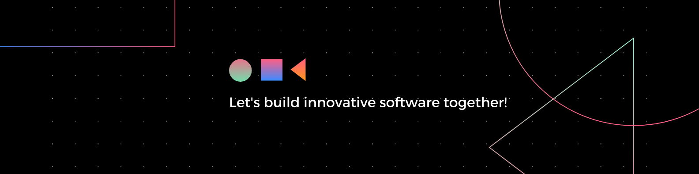

# Hello World!🌍  I'm Anastasiia, a Software Engineer from Canada 👋

🎓 Bachelor's Degree in Computer Science with a specialization in Artificial Intelligence 
👨🏼‍🎓 Software Engineering Diploma at BrainStation 
🧑‍💻 Strong background in HTML/CSS, Sass, JavaScript, React.js, Node.js, Python 
🔎 Passionate about AI and Machine Learning 
💼 Previous experience as an IT Project Manager

# 💻 Tech Stack:

                        

## 📊 GitHub Stats:

 

<picture>
  <source media="(prefers-color-scheme: dark)" srcset="https://raw.githubusercontent.com/anastasiiapipenko/anastasiiapipenko/output/pacman-contribution-graph-dark.svg">
  <source media="(prefers-color-scheme: light)" srcset="https://raw.githubusercontent.com/anastasiiapipenko/anastasiiapipenko/output/pacman-contribution-graph.svg">
  
</picture>
